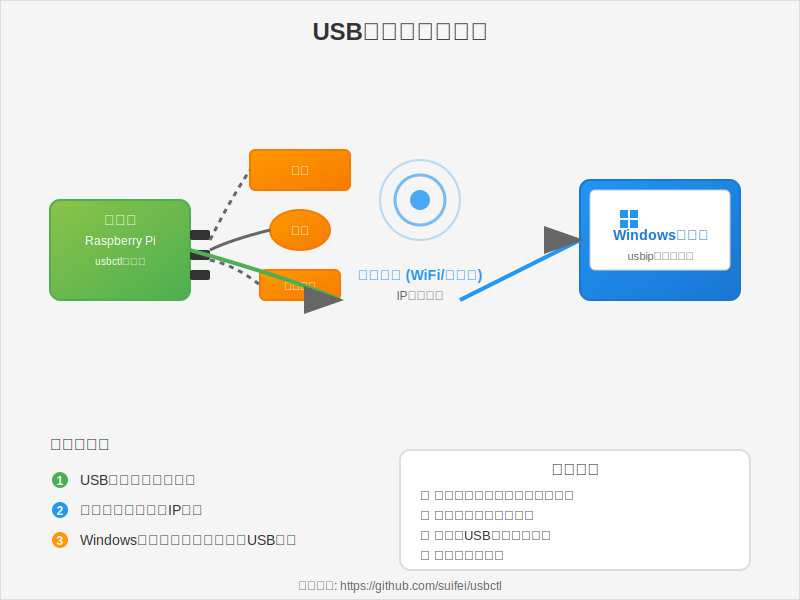

[English](README_en.md) | 中文

# usbctl - USB/IP 设备 Web 管理器

项目架构图




## 项目简介

**usbctl** 是一个轻量级、跨平台的 USB/IP 设备管理 Web 界面，支持 PC 和移动端响应式访问。它集成了设备列表、绑定/解绑操作、实时状态推送（SSE）、操作日志等功能，适用于 Linux（包括树莓派、Openwrt）、Windows（WSL/usbipd-win）、macOS 等环境。

- 单文件 C 语言实现
- 内嵌 HTML/CSS/JS 资源，无需外部依赖
- 支持配置持久化、自动恢复绑定
- 实时设备状态推送，AJAX 操作
- ARM Linux 优化，适合树莓派等嵌入式设备

## 目录结构

```
usbctl/
├── build/             # 编译输出目录，包含可执行文件 usbctl
│   └── usbctl         # 主程序，已编译（约944KB）
├── LICENSE            # 许可证
├── Makefile           # 构建脚本，支持多平台
├── usbctl.c           # 主程序源码
├── usbctl.jpg         # 界面截图
├── install-service.sh # 自动化部署脚本（推荐）
```

## 编译方法

推荐使用 Makefile 自动化构建：

```sh
make           # 构建本地平台静态二进制
# 或手动编译
gcc -static -O2 -o build/usbctl usbctl.c -lpthread
```

支持多平台交叉编译，详见 Makefile。

## 部署环境与流程（Raspberry Pi OS arm64 实测）

### 1. 运行 usbctl 检查依赖

```sh
./build/usbctl
# 若提示 usbip 未找到，需安装 usbip 工具
```

### 2. 安装 usbip 工具

适用于 Debian/Ubuntu/Raspberry Pi OS：

```sh
sudo apt update
sudo apt install usbip
```

### 3. 验证 usbip 工具

```sh
usbip
# 显示命令帮助即安装成功
```

### 4. 检查 USB 设备

```sh
lsusb -t
# 查看总线和设备信息
```

### 5. 加载内核驱动

```sh
sudo modprobe usbip-host
lsmod | grep usbip
# 应显示 usbip_host 和 usbip_core 模块已加载
```

### 6. 启动 usbipd 服务

```sh
sudo usbipd -D
ps -Al | grep usb
sudo netstat -tlnp | grep :3240
# 确认 usbipd 已监听 3240 端口
```

### 7. 放开防火墙端口（如有）

```sh
sudo ufw allow 3240/tcp
# 或检查 iptables 是否阻止
sudo iptables -L
```

### 8. 启动 usbctl Web 服务

```sh
sudo ./build/usbctl
# 默认监听 11980 端口，支持自定义
```

浏览器访问：

- http://localhost:11980
- http://树莓派IP:11980

---

## 🚀 自动化部署脚本（推荐方式）

为简化部署流程，项目提供了一个 **一键安装/卸载脚本** `install-service.sh`，适用于 **Debian / Ubuntu / Raspberry Pi OS (ARM64)** 系统。

该脚本会自动完成以下操作：

- ✅ 检测并安装 `usbip` 工具（兼容 Raspberry Pi OS 和通用 Debian）
- ✅ 自动加载并持久化 `usbip-host` 内核模块（开机自动加载）
- ✅ 启动 `usbipd -D` 守护进程（兼容无 systemd 服务的系统）
- ✅ 开放防火墙端口 `3240/tcp`（usbipd）和 `11980/tcp`（usbctl）
- ✅ 将 `usbctl` 安装到 `/usr/local/bin/usbctl`
- ✅ 创建标准化配置文件：`/etc/usbctl/config`
- ✅ 配置日志轮转（`/var/log/usbctl.log`）
- ✅ 安装并启用 **systemd 服务**，实现开机自启
- ✅ 自动检测并清理端口冲突（避免 "Address already in use"）

### 使用步骤

#### 1. 获取部署脚本

将以下脚本保存为项目根目录下的 `install-service.sh`（[点击此处获取脚本内容](#) 或从仓库下载）。

#### 2. 赋予执行权限

```bash
chmod +x install-service.sh
```

#### 3. 执行安装

```bash
sudo ./install-service.sh install
```

成功输出示例：
```
[INFO] 🚀 开始部署 usbctl...
[INFO] usbip 已安装
[INFO] 已写入 /etc/modules-load.d/usbip.conf 实现开机自动加载
[WARN] 未找到 usbipd.service，手动启动 usbipd -D
[INFO] 开放端口 3240/tcp (UFW)
[INFO] 开放端口 11980/tcp (UFW)
[INFO] 已创建默认配置文件：/etc/usbctl/config
[INFO] systemd 服务已启用并启动
[INFO] 已配置 logrotate：/etc/logrotate.d/usbctl
[INFO] ✅ 部署完成！访问 http://192.168.x.x:11980
```

#### 4. 验证服务状态

```bash
# 查看服务状态
systemctl status usbctl

# 查看实时日志
journalctl -u usbctl -f

# 检查端口监听
ss -tlnp | grep -E ':(3240|11980)'
```

#### 5. 卸载（可选）

```bash
sudo ./install-service.sh uninstall
```

> ⚠️ 卸载时会保留 `/etc/usbctl/config` 配置文件，避免误删用户自定义设置。如需彻底清除，请手动删除该目录。

### 配置文件说明

安装后，配置文件位于：

```ini
/etc/usbctl/config
```

默认内容：
```ini
port=11980
bind=0.0.0.0
poll_interval=3
verbose_logging=1
log_file=/var/log/usbctl.log
```

修改后需重启服务生效：
```bash
sudo systemctl restart usbctl
```

### 故障排查

| 问题 | 解决方案 |
|------|--------|
| `Bind failed: Address already in use` | 脚本已自动检测并清理，若仍出现，请手动执行 `sudo pkill -f usbctl` |
| `usbip: command not found` | 脚本会自动安装，若失败请手动运行 `sudo apt install usbip` |
| 无法访问 Web 界面 | 检查防火墙：`sudo ufw status`，确保 11980 端口开放 |
| 设备未显示 | 确保 USB 设备已插入，且 `usbip list -l` 能列出设备 |

> ✅ **推荐**：在树莓派等嵌入式设备上，优先使用此脚本部署，避免手动操作遗漏步骤。

---

## Windows 客户端推荐

建议使用微软认证（WHLK）的 usbip-win2 项目：

- https://github.com/vadimgrn/usbip-win2  

或官方 usbipd-win（WSL 支持）：

- https://github.com/dorssel/usbipd-win  

## 其他说明

- 支持 systemd 服务安装：`./build/usbctl --install-service`
- 配置文件默认路径：`~/.config/usbctl/config`（**脚本部署后改为 `/etc/usbctl/config`**）
- 日志文件默认路径：`/var/log/usbctl.log`
- 更多命令行参数见 `./build/usbctl --help`

## 许可证

MIT License，详见 [`LICENSE`](LICENSE)。

---

## 英文版

请参考 [README_en.md](README_en.md)。

---

如需更多帮助或反馈，请访问 [github.com/suifei/usbctl](https://github.com/suifei/usbctl)。
