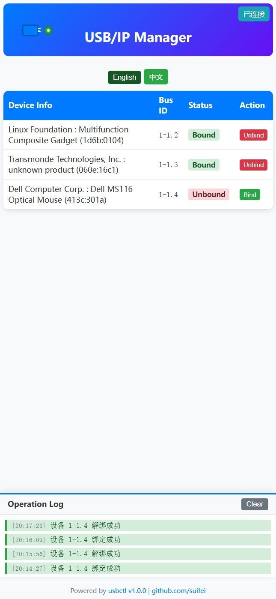

[English](README_en.md) | 中文

# usbctl - USB/IP 设备 Web 管理器



## 项目简介

**usbctl** 是一个轻量级、跨平台的 USB/IP 设备管理 Web 界面，支持 PC 和移动端响应式访问。它集成了设备列表、绑定/解绑操作、实时状态推送（SSE）、操作日志等功能，适用于 Linux（包括树莓派）、Windows（WSL/usbipd-win）、macOS 等环境。

- 单文件 C 语言实现
- 内嵌 HTML/CSS/JS 资源，无需外部依赖
- 支持配置持久化、自动恢复绑定
- 实时设备状态推送，AJAX 操作
- ARM Linux 优化，适合树莓派等嵌入式设备

## 目录结构

```
usbctl/
├── build/           # 编译输出目录，包含可执行文件 usbctl
│   └── usbctl       # 主程序，已编译（约944KB）
├── LICENSE          # 许可证
├── Makefile         # 构建脚本，支持多平台
├── usbctl.c         # 主程序源码
├── usbctl.jpg       # 界面截图
```

## 编译方法

推荐使用 Makefile 自动化构建：

```sh
make           # 构建本地平台静态二进制
# 或手动编译
gcc -static -O2 -o build/usbctl usbctl.c -lpthread
```

支持多平台交叉编译，详见 Makefile。

## 部署环境与流程（Raspberry Pi OS arm64 实测）

### 1. 运行 usbctl 检查依赖

```sh
./build/usbctl
# 若提示 usbip 未找到，需安装 usbip 工具
```

### 2. 安装 usbip 工具

适用于 Debian/Ubuntu/Raspberry Pi OS：

```sh
sudo apt update
sudo apt install usbip
```

### 3. 验证 usbip 工具

```sh
usbip
# 显示命令帮助即安装成功
```

### 4. 检查 USB 设备

```sh
lsusb -t
# 查看总线和设备信息
```

### 5. 加载内核驱动

```sh
sudo modprobe usbip-host
lsmod | grep usbip
# 应显示 usbip_host 和 usbip_core 模块已加载
```

### 6. 启动 usbipd 服务

```sh
sudo usbipd -D
ps -Al | grep usb
sudo netstat -tlnp | grep :3240
# 确认 usbipd 已监听 3240 端口
```

### 7. 放开防火墙端口（如有）

```sh
sudo ufw allow 3240/tcp
# 或检查 iptables 是否阻止
sudo iptables -L
```

### 8. 启动 usbctl Web 服务

```sh
sudo ./build/usbctl
# 默认监听 11980 端口，支持自定义
```

浏览器访问：

- http://localhost:11980
- http://树莓派IP:11980

## Windows 客户端推荐

建议使用微软认证（WHLK）的 usbip-win2 项目：

- https://github.com/vadimgrn/usbip-win2

或官方 usbipd-win（WSL 支持）：

- https://github.com/dorssel/usbipd-win

## 其他说明

- 支持 systemd 服务安装：`./build/usbctl --install-service`
- 配置文件默认路径：`~/.config/usbctl/config`
- 日志文件默认路径：`/var/log/usbctl.log`
- 更多命令行参数见 `./build/usbctl --help`

## 许可证

MIT License，详见 [`LICENSE`](LICENSE)。

---

## 英文版

请参考 [README_en.md](README_en.md)。

---

如需更多帮助或反馈，请访问 [github.com/suifei/usbctl](https://github.com/suifei/usbctl)。