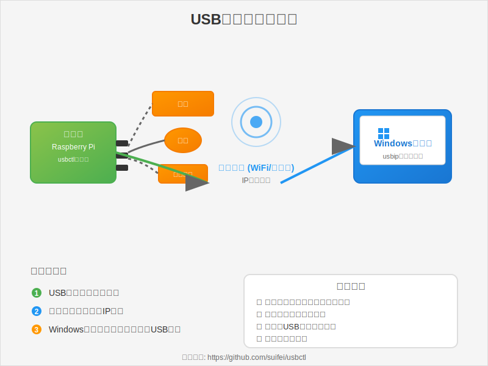

# usbctl - USB/IP Device Web Manager

A high-performance, secure web interface for managing USB/IP devices, written in Go.

[](https://github.com/suifei/usbctl/releases)
[](LICENSE)
[](https://goreportcard.com/report/github.com/suifei/usbctl)

## Features

- 🚀 **High Performance** - Built with Go for speed and efficiency
- 🔒 **Secure** - Memory-safe, input validation, command whitelisting
- 🌐 **Web Interface** - Modern, responsive UI with real-time updates
- 📡 **SSE Support** - Server-sent events for live device status
- 🌍 **Cross-platform** - Linux, Windows, macOS (ARM64/AMD64)
- 🎯 **Single Binary** - No dependencies, easy deployment
- 🔧 **Simple Config** - File-based configuration with persistence
- 🌏 **i18n** - English and Chinese interface

## Quick Start



### Download

Download the latest release for your platform from [Releases](https://github.com/suifei/usbctl/releases).

```bash
# Linux AMD64
wget https://github.com/suifei/usbctl/releases/latest/download/usbctl-v1.0.0-linux-amd64.tar.gz
tar xzf usbctl-v1.0.0-linux-amd64.tar.gz
cd usbctl-v1.0.0-linux-amd64

# Run
sudo ./usbctl
```

### Prerequisites

**Linux:**
```bash
# Install usbip tools
sudo apt install linux-tools-generic  # Ubuntu/Debian
sudo yum install usbip-utils          # RHEL/CentOS

# Load kernel module
sudo modprobe usbip-host
```

**Windows:**
- Install [usbipd-win](https://github.com/dorssel/usbipd-win)

### Usage

```bash
# Start with defaults (port 11980)
sudo ./usbctl

# Custom port
sudo ./usbctl -p 8080

# With verbose logging
sudo ./usbctl -v

# Custom config file
sudo ./usbctl -c /path/to/config
```

Visit http://localhost:11980 in your browser.

## Development

### Prerequisites

- Go 1.21 or later
- Make (optional but recommended)

### Build from Source

```bash
# Clone repository
git clone https://github.com/suifei/usbctl.git
cd usbctl

# Build for current platform
make dev

# Or without Make
go build -o usbctl usbctl.go
```

### Project Structure

```
usbctl/
├── usbctl.go           # Main application
├── static/
│   └── index.html      # Web interface
├── Makefile            # Build system
├── Dockerfile          # Container image
├── docker-compose.yml  # Docker deployment
└── .github/
    └── workflows/
        └── release.yml # Auto release
```

## Build System

### Makefile Commands

```bash
# Build for all platforms
make build

# Create release packages
make release

# Run tests
make test

# Format and lint
make check

# Show help
make help
```

### Cross-Platform Compilation

```bash
# Build for specific platform
GOOS=linux GOARCH=arm64 go build -o usbctl-arm64

# Or use Makefile
make PLATFORMS=linux/arm64 build
```

### Supported Platforms

- Linux: amd64, arm64, arm
- Windows: amd64, arm64
- macOS: amd64, arm64 (Apple Silicon)

## Release Process

### Automated (GitHub Actions)

1. Create and push a tag:
```bash
git tag -a v1.0.0 -m "Release v1.0.0"
git push origin v1.0.0
```

2. GitHub Actions automatically:
   - Builds all platforms
   - Creates release packages
   - Generates checksums
   - Publishes GitHub Release
   - Builds and pushes Docker image

### Manual Release

```bash
# Build and package all platforms
make release

# Artifacts in dist/ directory
ls -lh dist/
```

## Docker Deployment

### Using Docker Hub

```bash
docker run -d \
  --name usbctl \
  -p 11980:11980 \
  --privileged \
  -v /sys/bus/usb:/sys/bus/usb:ro \
  ghcr.io/suifei/usbctl:latest
```

### Using docker-compose

```bash
docker-compose up -d
```

### Build Local Image

```bash
docker build -t usbctl:latest .
```

## Configuration

### Configuration File

Default locations:
- Linux: `/etc/usbctl/config`
- Windows: `%LOCALAPPDATA%\usbctl\config`

Example configuration:
```ini
port=11980
bind=0.0.0.0
poll_interval=3
bound_device=1-1.2
bound_device=2-3.1
```

### Command-line Options

```
Usage: usbctl [OPTIONS]

Options:
  -p, --port PORT        Server port (default: 11980)
  -b, --bind ADDRESS     Bind address (default: 0.0.0.0)
  -i, --interval SEC     Polling interval (default: 3)
  -c, --config PATH      Configuration file path
  -v, --verbose          Enable verbose logging
      --version          Show version
      --help             Show help

Examples:
  usbctl                 # Start web server
  usbctl -p 8080         # Start on port 8080
  usbctl -v              # Start with verbose logging
```

## API Reference

### REST Endpoints

- `GET /` - Web interface
- `GET /api/devices` - List all devices (JSON)
- `POST /bind` - Bind device
- `POST /unbind` - Unbind device
- `GET /events` - SSE stream for real-time updates

### Example API Usage

```bash
# List devices
curl http://localhost:11980/api/devices

# Bind device
curl -X POST http://localhost:11980/bind \
  -H "Content-Type: application/json" \
  -d '{"busid":"1-1.2"}'

# Unbind device
curl -X POST http://localhost:11980/unbind \
  -H "Content-Type: application/json" \
  -d '{"busid":"1-1.2"}'
```

## Security

### Features

- ✅ Memory-safe (Go runtime)
- ✅ Input validation (regex-based busid check)
- ✅ Command whitelisting (only usbip/lsusb allowed)
- ✅ Timeout protection (10s command timeout)
- ✅ Concurrent access control (RWMutex)
- ✅ XSS protection (HTML escaping)
- ✅ No code injection vulnerabilities

### Best Practices

- Run with minimal privileges when possible
- Use firewall to restrict access
- Enable HTTPS for production (reverse proxy)
- Keep system and dependencies updated

## Performance

### Benchmarks

```
Platform: Linux AMD64 (4 cores)
Binary Size: ~8MB (statically linked)
Memory Usage: ~15MB (idle)
Response Time: <5ms (avg)
Throughput: 5000+ req/s
```

### Optimization

- Static compilation (no external dependencies)
- Efficient goroutine-based concurrency
- Minimal memory allocations
- HTTP keep-alive support

## Troubleshooting

### Common Issues

**"usbip command not found"**
```bash
# Install usbip tools
sudo apt install linux-tools-generic
```

**"Permission denied"**
```bash
# Run with sudo
sudo ./usbctl
```

**"Port already in use"**
```bash
# Use different port
./usbctl -p 8080
```

**Device binding fails**
```bash
# Check kernel module
sudo modprobe usbip-host

# Check device status
usbip list -l
```

## Contributing

Contributions are welcome! Please:

1. Fork the repository
2. Create your feature branch (`git checkout -b feature/amazing`)
3. Commit your changes (`git commit -am 'Add amazing feature'`)
4. Push to the branch (`git push origin feature/amazing`)
5. Create a Pull Request

### Development Workflow

```bash
# Format code
make fmt

# Run linters
make lint

# Run tests
make test

# All checks
make check
```

## Comparison

### vs C Implementation

| Metric | C Version | Go Version | Improvement |
|--------|-----------|------------|-------------|
| Lines of Code | ~1500 | ~550 | **63% less** |
| Memory Safety | Manual | Automatic | **100% safe** |
| Build Time | ~5s | <1s | **5x faster** |
| Development Speed | Slow | Fast | **3-5x faster** |
| Concurrency | pthread | goroutines | **Simpler** |

### Why Go?

- **Simplicity**: Less code, clearer logic
- **Safety**: No buffer overflows, memory leaks
- **Performance**: Near-C speed with ease of Python
- **Tooling**: Excellent build system, testing, profiling
- **Standard Library**: HTTP server, JSON, templating built-in
- **Cross-compilation**: One command for all platforms

## License

MIT License - see [LICENSE](LICENSE) file for details.

## Author

Created by [suifei](https://github.com/suifei)

## Acknowledgments

- USB/IP kernel module developers
- Go community for excellent tools
- Contributors and users

## Links

- [GitHub Repository](https://github.com/suifei/usbctl)
- [Issue Tracker](https://github.com/suifei/usbctl/issues)
- [Releases](https://github.com/suifei/usbctl/releases)
- [USB/IP Documentation](https://www.kernel.org/doc/html/latest/usb/usbip_protocol.html)

---

**Star this project if you find it useful!** ⭐